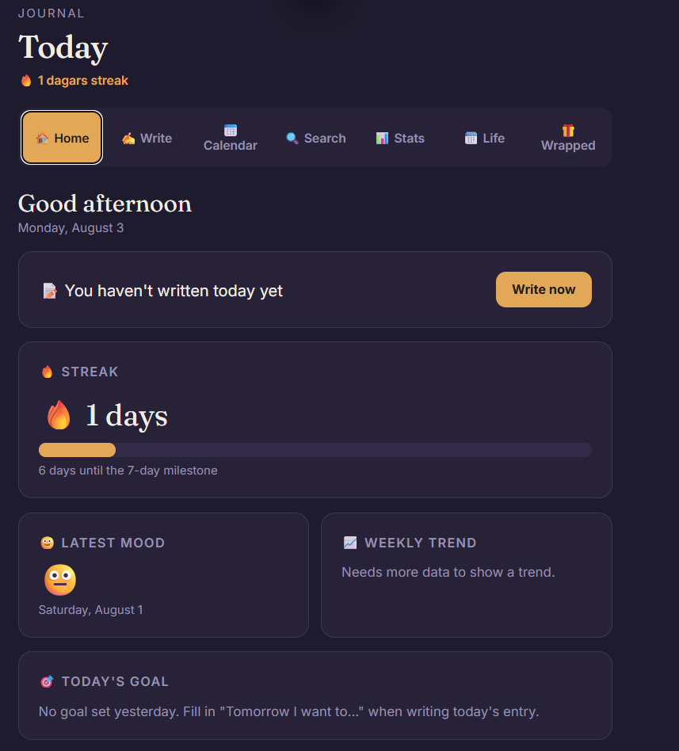
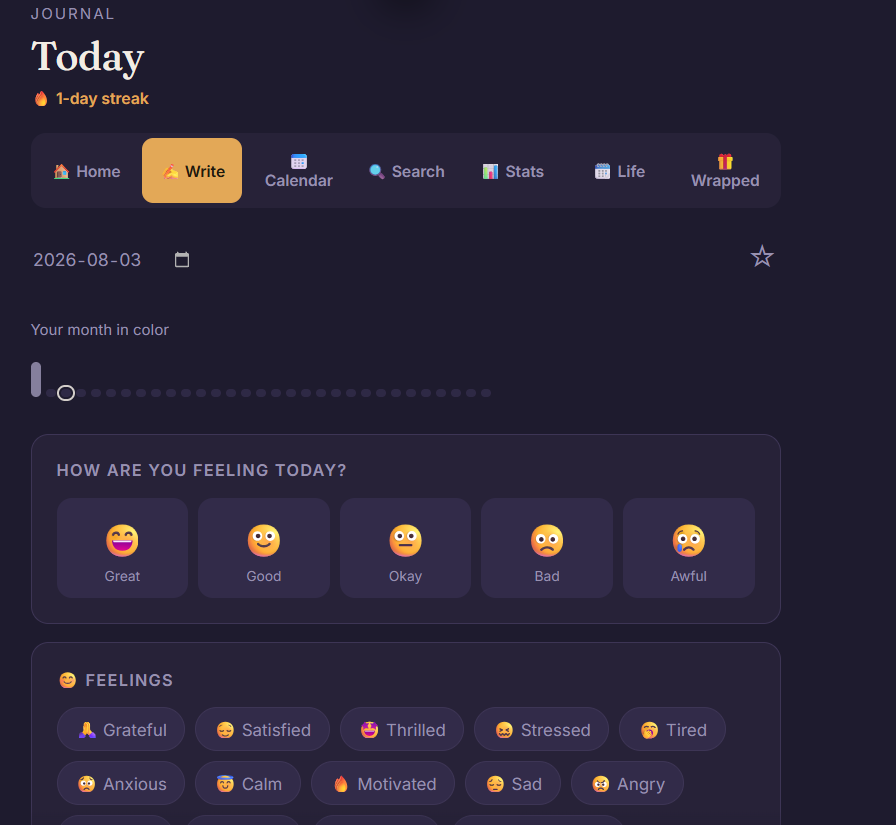
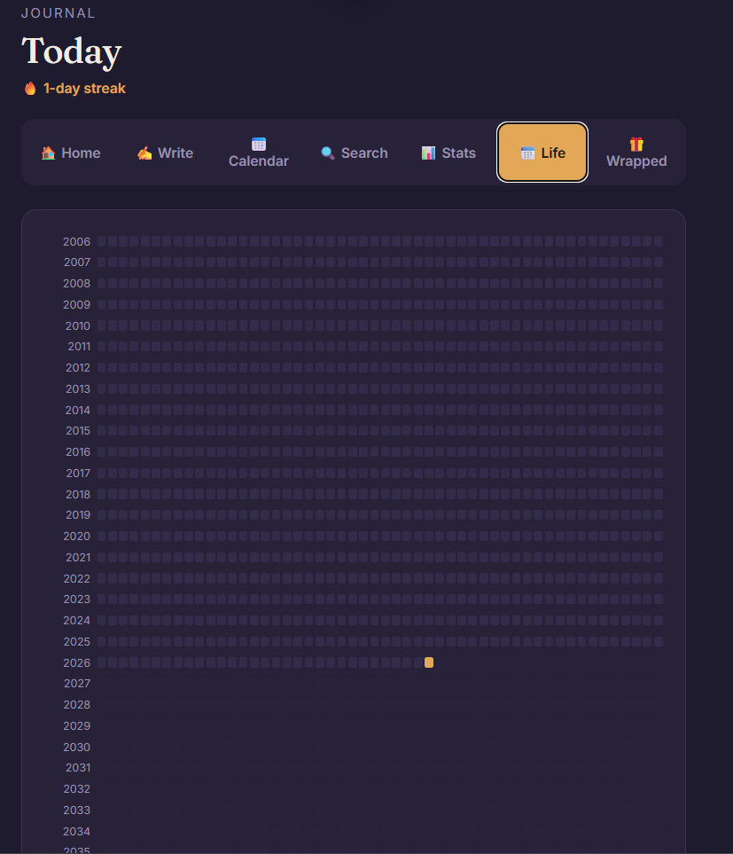
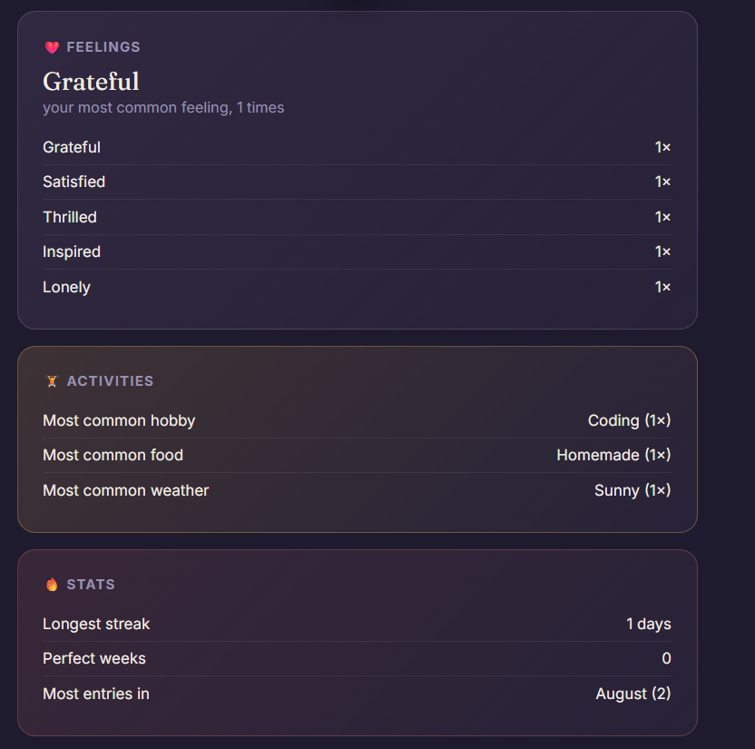

# Journal — a personal, private, installable journaling app

A privacy-first personal journal you can run entirely on your own device. No account, no server, no tracking — your entries never leave your browser's local storage. Built as an installable Progressive Web App (PWA), fully bilingual (English/Swedish), and ready to run straight from GitHub with zero configuration.

## 🚀 Live Demo

Try the application here:
[Open Personal Journal PWA](https://biiinn.github.io/Personal-Journal-PWA/)








## Features

- **📷 Photo gallery per entry** — attach multiple photos to any day, browse them in a full-screen lightbox with keyboard/click navigation, reorder by drag-and-drop, and remove individual photos. Photos are automatically compressed before storage. See [Image storage](#image-storage-localstorage-vs-indexeddb) below for how this is kept fast and scalable.
- **Daily entries** — mood (5 levels), feelings, sleep, energy, physical activity, hobbies, food, social contact, relationships, places, self-care, chores, weather, a gratitude list, a highlight/lowlight, tomorrow's focus, screen time, spending, step count, and free-form notes with a word-count goal
- **✍️ Focus mode** — a distraction-free fullscreen writing view for longer entries, live-synced with the regular notes field
- **💾 Autosave** — changes save themselves ~2s after you stop typing, and immediately when you switch tabs, dates, or close the page; a subtle indicator shows "Saving..." / "All changes saved"
- **🗑️ Delete an entry** — remove a day's entry (and any photos that belonged to it) after a confirmation step
- **Custom options** — add your own entries to almost any category; remove them again just as easily
- **🏠 Home dashboard** — greeting, streak, latest mood, weekly trend, today's goal, a daily reflection question, recent entries, favorites, a random memory, and "this day in past years"
- **📅 Calendar** — full month view with mood-colored days, plus a history list
- **🔍 Search** — full-text search across every entry, in either language
- **📊 Stats** — mood distribution (chart or table), most common activities/feelings, and locally-computed insights (e.g. "you tend to feel better on days you work out") — no external AI involved, ever
- **🗓️ Life calendar** — your whole life as one square per week, GitHub-contribution-graph style, zoomable into a day-by-day view of any year
- **🎁 Wrapped** — a Spotify-Wrapped-style annual report generated from your own data
- **🏅 Milestones** — streaks, entry counts, word counts, and more, unlocked permanently with a small celebration animation
- **🔒 Your own PIN code** — chosen during onboarding, changeable anytime, never hardcoded
- **🌐 Bilingual** — English and Swedish, switchable anytime, remembered across sessions
- **📲 Installable (PWA)** — add it to your home screen or desktop, works offline, updates safely in the background

## Installation

No build step, no dependencies, no backend. Clone or download this repository:

```bash
git clone https://github.com/YOUR_USERNAME/journal-app.git
cd journal-app
```

## Running the project

Because the app registers a Service Worker (for offline support), it must be served over `http://localhost` or `https://` — opening `index.html` directly by double-clicking it (`file://`) will not work correctly.

**Easiest option — VS Code + Live Server:**
1. Open the project folder in VS Code
2. Install the "Live Server" extension (by Ritwick Dey)
3. Right-click `index.html` → "Open with Live Server"

**Alternative — any local static server**, for example:
```bash
python3 -m http.server 8080
# then open http://localhost:8080
```

## Installing the PWA version

Once the app is running in a browser that supports installation (Chrome, Edge, and most Chromium-based browsers):
1. An "Install the app" banner appears automatically — tap **Install**
2. On iOS Safari (which doesn't support automatic installation), use **Share → Add to Home Screen**
3. The installed app opens in its own window, with no browser address bar, its own icon, and full offline support

## First run: onboarding

The very first time the app opens, a short setup flow walks you through:
1. Choosing a language (English/Swedish)
2. Optionally entering a name
3. Creating your own PIN code

After that, the app opens straight to your dashboard on every future visit — no repeated setup.

## How backup works

All data lives in your browser's `localStorage`, scoped to the site's origin. Nothing is sent anywhere.

- **Export:** Stats → Backup → "Export all data" downloads every entry as a single JSON file
- **Nothing is uploaded automatically** — you control if/when/where a backup file goes
- **Caveat:** clearing your browser's site data, or switching browsers/devices, means the app starts empty on that browser/device. There is currently no built-in *import* — see Roadmap below.

## How profiles work

This is a fully client-side app with no server, so there's no multi-account login system in the traditional sense. Instead:

- Each **browser + device combination** is its own private "profile" — your entries, PIN, language choice, and custom options are all scoped to that browser's local storage
- Multiple people can use the same installed app on **different browsers or devices** without ever seeing each other's data
- There is currently no way to switch between multiple profiles *within the same browser* — see Roadmap

## Project structure

```
journal-app/
├── index.html              # App shell — structure only, no hardcoded text
├── style.css                # All styling, including PWA-specific rules
├── script.js                 # Core application logic (tabs, entries, stats, etc.)
├── manifest.webmanifest      # PWA install metadata
├── service-worker.js         # Offline caching and update handling
├── translations/
│   ├── en.js                 # English strings
│   └── sv.js                 # Swedish strings
├── utils/
│   ├── i18n.js                # Translation engine (t(), setLanguage(), ...)
│   ├── storage.js             # localStorage-backed storage layer (text data)
│   └── imageStore.js          # IndexedDB-backed storage layer (photos)
├── components/
│   ├── onboarding.js           # First-run setup flow
│   ├── settings.js             # PIN change + language switcher
│   ├── gallery.js              # Multi-photo gallery, lightbox, drag-and-drop reorder
│   ├── focusMode.js            # Fullscreen distraction-free writing view
│   └── confirmDialog.js        # Reusable "are you sure?" confirmation modal
└── icons/                    # App icons in all required PWA sizes
```

## Image storage: localStorage vs. IndexedDB

Journal text (mood, notes, categories, etc.) is small and stays in `localStorage`, same as before. Photos are a different story, and they're stored in **IndexedDB** instead, via `utils/imageStore.js`. Here's why:

| | localStorage | IndexedDB |
|---|---|---|
| Quota | ~5–10MB **total**, shared across all app data | Commonly hundreds of MB, sometimes GBs (browser-dependent) |
| Format | Text only — images must be base64-encoded, which inflates size by roughly a third | Stores binary `Blob`s natively, no encoding overhead |
| Access | Synchronous — large reads/writes can freeze the UI | Asynchronous by design, never blocks the interface |
| Failure mode | Filling the quota with photos breaks saving for **every** entry, including plain text ones, since it's one shared pool | Photos live in their own storage pool; running low there has no effect on journal text |

A journal entry only ever stores a small ordered array of photo IDs (e.g. `entry.photos = ["a1b2c3", "d4e5f6"]`) in `localStorage`. The actual image bytes live in IndexedDB, keyed by those same IDs, and are fetched on demand whenever a thumbnail or the lightbox needs to display them. Reordering photos only touches that small ID array — the underlying blobs never move.

**Known trade-off:** the JSON backup exported from Settings → Backup contains journal text only, not photos (see the in-app note next to the export button). Including full-resolution photo data in that export would mean re-encoding every image back to base64 text, reintroducing the exact size problem IndexedDB was chosen to avoid. A dedicated photo-inclusive export (e.g. a `.zip`) is a reasonable future addition — see Roadmap.


**Why split it up this way?** `translations/` and `utils/` are genuinely independent of the rest of the app — the i18n engine doesn't know anything about journal entries, and the storage shim doesn't know anything about translations. Splitting them out means each can be tested, reused, or replaced on its own. `components/onboarding.js` and `components/settings.js` are similarly self-contained UI flows. The core tab-rendering logic in `script.js` stays as one file rather than being split further, since those functions share a lot of interdependent state (the current entry, the category definitions, the mood list) — splitting them across files without a build step/bundler would mean juggling load order and global scope without a real benefit.

## Localization

All UI text is looked up through `t('some.key')` — nothing is hardcoded in HTML or JS. Adding a third language means creating `translations/xx.js` following the same structure as `en.js`, then adding a button in `components/settings.js`'s language switcher.

One deliberate design decision: category values (moods, feelings, hobbies, etc.) are stored as **English keys** (e.g. `"grateful"`, `"noExercise"`), not as display text. This means switching languages never breaks previously-saved entries, and search works across both languages. Custom options you type yourself are stored as literal text (there's no way to auto-translate something that doesn't exist in the dictionary) and are shown exactly as you wrote them, in whichever language you're in.

## Roadmap

- [ ] Photo-inclusive backup export (e.g. a `.zip` alongside the JSON)
- [ ] Import a previously exported JSON backup
- [ ] Multiple profiles within a single browser
- [ ] Local AI insights, expanded (more correlations, longer history)
- [ ] Additional languages
- [ ] Optional passphrase-based encryption of exported backups
- [ ] Light theme

## License

MIT — see [LICENSE](LICENSE).
